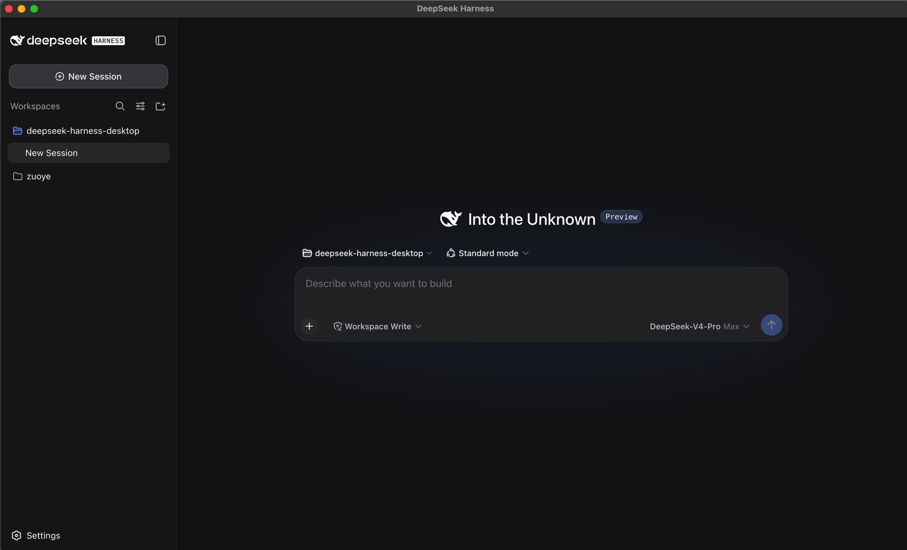
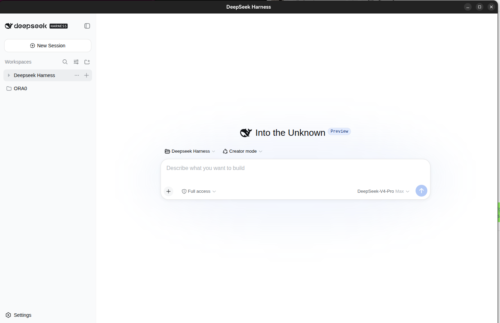

<p align="right"><strong>English</strong> · <a href="./README.zh-CN.md">中文</a></p>

# DeepSeek Harness Desktop (dsh-desktop-linux)

> **Provenance** — This is an **independent, renamed release** of [`hzhe0083-source/deepseek-harness-desktop`](https://github.com/hzhe0083-source/deepseek-harness-desktop) (also published as `anywhere-labs/deepseek-harness-desktop`). It is rebranded **dsh-desktop-linux** to distinguish it from the unrelated npm package `dsh-desktop`. **It is not an official DeepSeek project.**
> - Original project: `deepseek-harness-desktop` (MIT)
> - Version `1.0.0` is this release's own version number (upstream base: `0.5.1`); it is distinct because the source is modified.
> - Upstream: [hzhe0083-source/deepseek-harness-desktop](https://github.com/hzhe0083-source/deepseek-harness-desktop)
> - The original MIT LICENSE and copyright are preserved (see [LICENSE](LICENSE)).
> - **Enhancement:** the desktop shell honors `DSH_DESKTOP_PATCH` and `DSH_DESKTOP_EXTRA_ARGS`, so the bundled `dsh web` can load a plugin overlay via `--patch`. Auto-update is now pointed at **this** repository (not upstream), so updates keep the enhancement.

## Download & install

### Option 1 — Download the prebuilt AppImage (recommended)

Download the release AppImage and verify its SHA-256:

```bash
wget https://github.com/LaoGordon/dsh-desktop-linux/releases/download/v1.0.0/DeepSeek-Harness-Desktop-1.0.0-linux-x86_64.AppImage
sha256sum DeepSeek-Harness-Desktop-1.0.0-linux-x86_64.AppImage
# expected: 55b87cd450bffb9610b7551904d00cbbcce750dc8fc5af7056277315cff2faff
chmod +x DeepSeek-Harness-Desktop-1.0.0-linux-x86_64.AppImage
./DeepSeek-Harness-Desktop-1.0.0-linux-x86_64.AppImage
```

### Option 2 — Build from source

```bash
git clone https://github.com/LaoGordon/dsh-desktop-linux.git
cd dsh-desktop-linux
npm install
npm run dist:linux    # outputs AppImage + deb into dist/
# dist/DeepSeek-Harness-Desktop-1.0.0-linux-x86_64.AppImage
# dist/DeepSeek-Harness-Desktop-1.0.0-linux-amd64.deb
```

Both options produce the **same** AppImage (same name and SHA-256), and both include the `DSH_DESKTOP_PATCH` pass-through enhancement.

### Requirements

- Linux x86_64.
- **To run the prebuilt AppImage:** nothing else is required — it bundles Electron and self-downloads a pinned `dsh` runtime into the user-data directory on first launch (no system Node/npm/dsh needed).
- **To build from source:** Node.js 18+ and npm.
- On first launch the AppImage mounts itself; if `libfuse2` is missing it automatically falls back to `--appimage-extract`-and-run, so no manual extraction is needed.

## Enhanced usage — load custom plugins via `--patch`

The stock desktop shell launches an internal `dsh web` with a fixed command. This release adds two environment-variable hooks so you can load your own plugin overlay:

| Environment variable | Effect |
|---|---|
| `DSH_DESKTOP_PATCH` | If set, injects `--patch <value>` into the internal `dsh web` command |
| `DSH_DESKTOP_EXTRA_ARGS` | If set, appends arbitrary extra args (shell-split, quote-aware) |

### The patch file (a cordis overlay)

`--patch` takes a cordis patch YAML that registers plugins. Minimal example (`~/cordis.yml`):

```yaml
- insert:
    - id: my-plugin
      name: /absolute/path/to/plugin.js
    - id: another-plugin
      name: /absolute/path/to/plugin.ts
      config:
        some: option
```

Use absolute paths for local plugin files, or npm package names for installed plugins.

### Method A — shell wrapper for `dsh desktop` (recommended)

Add this to `~/.bashrc`, then `source ~/.bashrc`:

```bash
dsh() {
  if [ "$1" = "desktop" ]; then
    shift
    local patch=/home/<you>/cordis.yml            # ← your plugin registration file
    local outp=()
    while [ "$#" -gt 0 ]; do
      case "$1" in
        --patch) [ -n "$2" ] && patch="$2" && shift 2 || shift ;;
        *) outp+=("$1"); shift ;;
      esac
    done
    DSH_DESKTOP_PATCH="$patch" \
      /path/to/DeepSeek-Harness-Desktop-1.0.0-linux-x86_64.AppImage "${outp[@]}"
  else
    command dsh "$@"
  fi
}
```

Then:

```bash
dsh desktop                              # loads the default ~/cordis.yml
dsh desktop --patch /your/other.yml      # loads a specific overlay
dsh desktop --offline                    # other args pass through unchanged
```

### Method B — environment variable directly

```bash
DSH_DESKTOP_PATCH=/your/cordis.yml ./DeepSeek-Harness-Desktop-1.0.0-linux-x86_64.AppImage
```

### How it works

The internal command is normally:

```sh
dsh web --host 127.0.0.1 --port <random-free-port>
```

With `DSH_DESKTOP_PATCH=/a/b.yml` it becomes:

```sh
dsh web --patch /a/b.yml --host 127.0.0.1 --port <random-free-port>
```

The port is still auto-assigned by the shell and cannot be overridden through this mechanism.

## About the AppImage & building

- `main/main.js` here is **source**, not a build artifact. The single, small enhancement lives in `launchForPort()` (see `DSH_DESKTOP_PATCH` / `DSH_DESKTOP_EXTRA_ARGS`).
- On Linux the AppImage is a read-only squashfs. It is mounted (or extracted) on first run; the enhancement lives inside the packaged `resources/app.asar`.
- Auto-update (electron-updater) is configured against **this** repository, so updates come from here and keep the enhancement. The upstream original AppImage does **not** contain this patch.

## Screenshots

| macOS | Linux |
| --- | --- |
|  |  |
